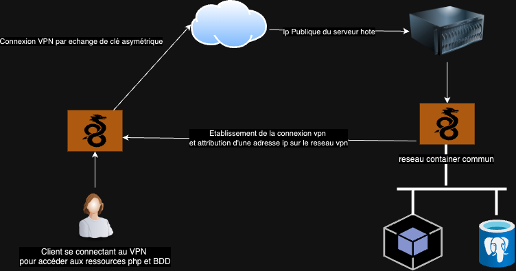

# docker compose vpn Wireguard Datakode

La livraison du code contient deux docker compose: 

- **docker-compose.yml**: Contenant une configuration générique de l'implémentation d'un container wireguard avec un container apache-php et un container posgresql

- **docker-compose-datakode.yml**: Adaptation du docker-compose fourni pour y intéger le vpn Wireguard.
 
### Principe de fonctionnement ###

Le principe de fonctionnement est simple, le docker compose va creer 3 containers ayant un réseau commun appelé **wgnet**.

Ensuite lors de la creation du container de la solution VPN WIREGUARD, ce dernier disposera d'un acces publique depuis l'adresse ip du serveur hôte (cf variable **SERVERURL** à renseigner dans le docker-compose) ensuite ce dernier va créer un réseau dédié à la connexion VPN (cf variable **INTERNAL_SUBNET** dans le docker-compose)

Il y a ensuite des paramètres de configuration permettant le transfère des flux du réseau interne vpn vers le réseau wgnet des containers docker.

Afin de maitriser le plan ip sur le reseau des containers, il a etait décider de fixer les ips. aussi nous aurons par exemple :

- ip 10.0.0.2 == Ip du serveur VPN Wireguard sur le reseau docker
- ip 10.0.0.3 == Ip du serveur Apache-PHP
- ip 10.0.0.4 == Ip du serveurs Postgresql

### Schémas de fonctionnement ###

 

### Eléments important de paramêtrage du container WireGuard

Ci-dessous les éléments importants à paramétrer dans le docker-compose pour la mise en place de Wireguard:

-  sur la section environment:

     * SERVERURL : Correspond à l'adresse ip publique où le nom fqdn du serveur hôte
     * SERVERPORT: Port d'écoute du serveur vpn
     * PEERS: il s'agit d'une liste des clients du vpn, celà permet la génération de leur configuration
     * INTERNAL_SUBNET: Il s'agit du subnet réseau dédié au vpn, pour chaque clients et serveur une adresse ip sera attribuée dans ce réseau.
     * ALLOWEDIPS: Définit les subnets autorisés via le réseau VPN

- sur la section sysctls:

     * net.ipv4.ip_forward : permet d'autoriser le forward de trames vers d'autres réseaux, dans notre cas pour accèder au réseau commun docker.
     * net.ipv4.conf.all.src_valid_mark : permet de marquer comme valide les sources de traffic arrivant sur le container docker.

- sur la section cap_add:
    Cette section permet de donner des privilèges au containers docker, sur le serveur hôte.
    * NET_ADMIN : permet de donner des droits d'opération sur des éléments de gestion du réseau, cette directive est nécessaire pour gérer les transferts de flux entre les différents réseaux utilisés
    * SYS_MODULE: permet de gerer des modules kernels

### Connexion au vpn avec un client Wireguard ###

La documentation officielle de Wireguard ci dessous explique comment effectuer la connexion au vpn via les différentes versionde client disponible:

[documentation_officielle_wireguard](https://www.wireguard.com/)

- MacOS
- Linux
- Windows
- IOS
- Android

Il y a généralement deux possibilités pour charger la configuration vpn, pour celà il faudra récupérer au niveau du volume du container Wireguard le fichier de configuration correspondant au client que l'on souhaite configurer, par exemple le client peer_client1. La configuration se trouve dans le dossier peer_client1 qui se trouve dans le répertoire configs du container Wireguard.

il y a deux fichiers permettant de récuperer la configuration :

- Soit un fichier png contenant le QRCODE de la configuration (recommandé pour Android et IOS)

 

- Soit un fichier de configuration à importer dans le client Wireguard (recommandé pour linux, windows et macOS)

 [exemple d'un fichier de configuration](extras/peer_client1.conf) 